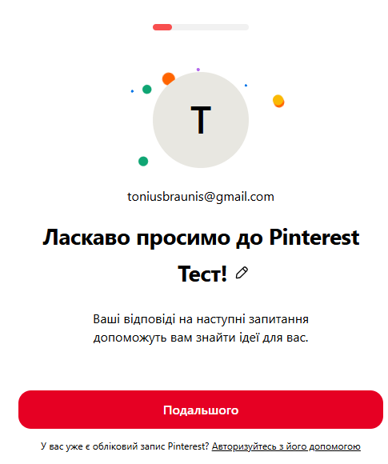

# Тест Кейс 1

**Назва :** Успішна реєстрація нового користувача на Pinterest

**Передумови :** Користувач раніше не зареєстрований

**Пріоритет :** Високий

**Модуль :** Форма реєстрації

**Тестові дані :** email - test@gmail.com ; пароль - Test1234q! ; дата народження - 01.01.2000 ; 

**Кроки :** 1. Перейти на сторінку реєстрації [Pinterest](https://www.pinterest.com/create-personal)

2. Ввести email: test@gmail.com  

3. Ввести пароль: Test1234q!  

4. Ввести ім’я: Tester  

5. Натиснути кнопку "Продовжити"

**Очікуваний результат :** Користувач успішно реєструється та перенаправляється на вікно з вітанням успішної реєстрації, де знаходиться кнопка "Подальшого". 

**Фактичний результат :** 

**Статус :** Pass ✅

**Коментар : Після виконаних кроків на скріншоті, можемо побачити, що фактичний результат відповідає очікуваному, тому ставимо статус Pass.**